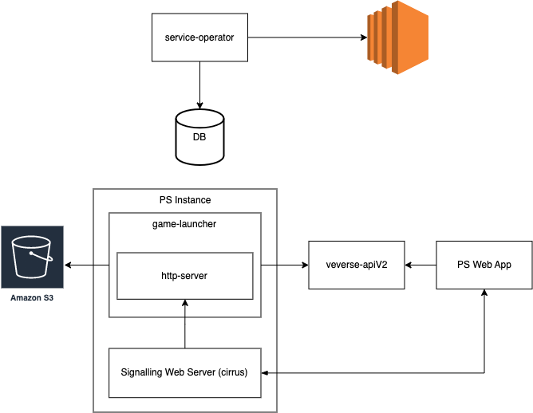

## Veverse Pixel Streaming Launcher

Launcher does not know anything about the machine it is running at, the machine can go down any time. Launcher is always running inside the instance.
Each T seconds it checks if any app session should be started, and assigns itself to a such `pending` session.
The session receives the `starting` status while the launcher is preparing the session desired app and world game files.
When required game files are ready, then launcher starts the game itself with required arguments and changes session status to `running`.

        T = 30 seconds

### Launcher HTTP Server
- Launcher HTTP Server handles requests from the signalling web server.
- DELETE /session endpoint is used to close sessions if client session is closed on the client side (e.g. browser tab is closed).
- GET /healthcheck endpoint is used to check if client connection is still alive. If not, then change session status to `closed` and terminate the game app.
- service-operator checks closed sessions and terminates instances if there are no active sessions on the instance.